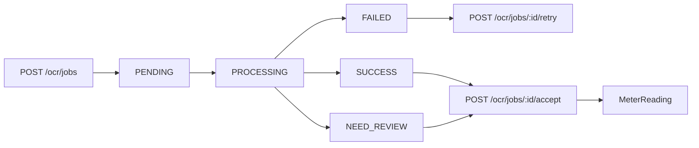

# OCR công tơ

> Cập nhật 31/07/2026. OCR là workflow có người duyệt, không tự xác nhận chỉ số dùng để tính hóa đơn.

## Luồng

## API

| Method/path | Mục đích |
|---|---|
| `GET /ocr/jobs` | Danh sách theo tenant/filter |
| `GET /ocr/jobs/:id` | Chi tiết job |
| `POST /ocr/jobs` | Upload ảnh và tạo job |
| `POST /ocr/jobs/:id/retry` | Retry job failed hợp lệ |
| `POST /ocr/jobs/:id/accept` | Chấp nhận/chỉnh số và tạo reading |

Chi tiết multipart field, query, role và response xem [API reference](API_REFERENCE.md#ocr).

## Quy tắc

- Bearer JWT và `x-tenant-id`; role theo controller.
- Create chịu profile rate-limit `ocr-create`, giới hạn kích thước upload và MIME ảnh.
- Meter/room/contract phải thuộc tenant và tương thích.
- Provider là Tesseract hoặc Google Vision theo cấu hình; ảnh có thể được chuẩn hóa bằng Sharp.
- Confidence thấp hoặc parse mơ hồ chuyển `NEED_REVIEW`.
- `accept` luôn dùng giá trị người dùng xác nhận; kiểm tra không nhỏ hơn reading trước và không tạo trùng kỳ.
- Retry chỉ áp dụng state cho phép và không tạo job/song song ngoài kiểm soát.

## Cấu hình

- `OCR_CONFIDENCE_THRESHOLD`
- `OCR_CREATE_RATE_LIMIT`, `OCR_RATE_TTL_MS`
- `OCR_UPLOAD_MAX_BYTES`
- Google Vision credential nếu chọn provider tương ứng
- Redis/BullMQ để xử lý async

Không ghi credential, ảnh công tơ thật hoặc response provider chứa PII vào tài liệu/log.

## Failure mode

- Provider timeout/download lỗi: job `FAILED`, lưu error đã sanitize.
- Confidence thấp: `NEED_REVIEW`, không tạo reading tự động.
- Job đã accept/đang xử lý: action lặp trả conflict.
- Queue retry phải idempotent; worker bỏ qua job không còn ở trạng thái xử lý được.

## Kiểm thử

- Upload/type/size/rate-limit.
- Tenant isolation.
- Provider success/low confidence/timeout/retry exhausted.
- Accept với số hợp lệ/nhỏ hơn reading trước/trùng kỳ.
- Worker retry không tạo hai `MeterReading`.
