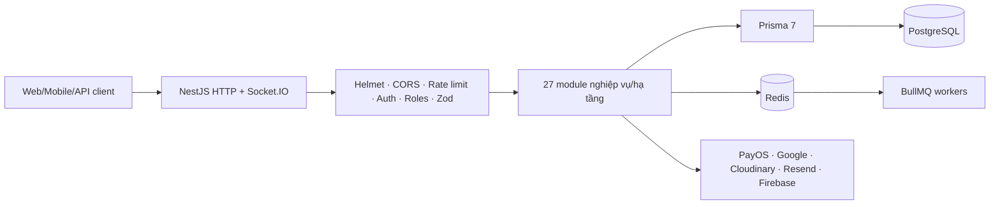
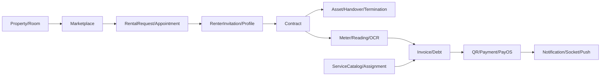

# Mô tả kiến trúc hệ thống MVP

> Hiện trạng ngày 31/07/2026. Tài liệu mô tả code đang tồn tại, không phải kiến trúc giả định.

## 1. Mục tiêu và ranh giới

Backend là modular monolith NestJS cho SaaS multi-tenant và marketplace. Workspace chưa có frontend/mobile; vì vậy kiến trúc đã kiểm chứng hiện chỉ bao gồm backend, PostgreSQL, Redis và adapter dịch vụ ngoài.

## 2. Sơ đồ tổng quan

## 3. Application pipeline

1. Helmet và CORS allowlist được cấu hình trong `main.ts`.
2. Global throttler dùng Redis; auth/resource route có profile riêng.
3. `AuthenticationGuard` chọn Bearer/API key/Payment API key/public theo metadata.
4. `AccessTokenGuard` xác minh user, tenant context và role hiện hành.
5. `RolesGuard` áp dụng `@Roles`; ADMIN có quyền nền tảng.
6. `ZodValidationPipe` từ chối payload ngoài schema.
7. `ApiExceptionFilter` chuẩn hóa lỗi và request correlation.

## 4. Module graph

| Miền | Module chính |
|---|---|
| Identity/SaaS | Auth, Users, Tenants, Plans, SubscriptionPayments |
| Supply | Properties, Rooms, Amenities, Assets |
| Marketplace | Marketplace, RentalRequests, Renters |
| Contract lifecycle | Contracts, Handovers, ContractTerminations |
| Utility/billing | UtilityMeters, ServiceCharges, OCR, Invoices, Payments, PayOS |
| Operations/trust | Tickets, Notifications, Dashboard, Reviews, Reports |
| Hạ tầng | Database, SharedService, Cache, Throttler, BullMQ |

Các controller được nạp qua `AppModule`; runtime hiện có 34 controller và 214 operation.

## 5. Luồng dữ liệu chính

## 6. Multi-tenant

- Dữ liệu vận hành gắn `tenantId`; client staff truyền `x-tenant-id`.
- Guard kiểm tra membership, trạng thái user/tenant/member và role tại request time.
- Repository phải lọc tenant và soft-delete; tài nguyên ngoài scope thường trả `404` để tránh lộ tồn tại.
- Renter self-service xác định phạm vi từ user/profile/contract, không tin tenant do client gửi.
- ADMIN dùng route nền tảng riêng hoặc bypass role theo guard, nhưng vẫn phải tuân thủ business scope của service.

## 7. Dữ liệu và transaction

PostgreSQL là nguồn bền vững; Prisma schema hiện có 61 model và 49 enum. Các luồng tiền, OTP/token, webhook, hợp đồng/bàn giao sử dụng transaction hoặc conditional update để chống ghi đè/race. Migration được áp dụng bằng `prisma migrate deploy`; không chạy `migrate dev/reset` trong production.

## 8. Queue, realtime và dịch vụ ngoài

| Thành phần | Hiện trạng backend | Điều kiện vận hành |
|---|---|---|
| Redis/BullMQ | Đã cấu hình cho rate limit, notification, OCR/payment maintenance | Redis khả dụng |
| Socket.IO | Gateway notification đã có | Client kết nối và xác thực |
| Firebase | Push service/provider đã có | Service account/project hợp lệ |
| PayOS | QR, invoice/subscription checkout, webhook đã có | Credential và callback production |
| OCR | Tesseract/Google Vision provider + queue/review | Provider/worker và upload storage |
| Cloudinary | Ảnh phòng/upload | Credential và policy storage |
| Resend/Google OAuth | Email/OTP/OAuth | Credential và redirect URL |

## 9. API contract

Swagger được mount ở `/docs`, JSON tại `/docs-json`. `npm run openapi:export` sinh `openapi.json`, runtime index và API reference. Contract runtime là nguồn canonical cho method/path/security/error; đặc tả G01–G12 giải thích state transition và quy tắc nghiệp vụ.

## 10. Security model

- Secret chỉ lấy từ môi trường, không nằm trong tài liệu hoặc source tracked.
- Production CORS fail-closed; Helmet bật HSTS.
- OTP/refresh token one-time, payment/webhook idempotency và tenant guard có unit test.
- Webhook log chỉ lưu payload đã sanitize, HMAC digest và retention metadata.
- Global/resource rate limit trả `429` và `Retry-After`.

## 11. Khả năng triển khai

Repo chưa có Docker/IaC/pipeline production canonical. Một deployment cần tối thiểu app process, PostgreSQL, Redis, migration job, secret manager, TLS/reverse proxy và monitoring/log aggregation. Worker BullMQ hiện nằm trong module graph của app; có thể tách process khi tải tăng.

## 12. Giới hạn và backlog

- Frontend/mobile chưa triển khai nên chưa có nghiệm thu người dùng end-to-end.
- Contract template/file/signature, invoice batch, conversation/chat, reputation aggregate và audit/system-setting API chưa đầy đủ.
- Chưa có kiểm chứng staging cho provider ngoài, benchmark hoặc chaos/failover.
- Dashboard dùng REST; Socket.IO dành cho notification, không biến dashboard thành realtime.

## 13. Nguồn đối chiếu

- `src/app.module.ts`, `src/main.ts`, `src/config/*`
- `src/modules/*`, `src/common/guard/*`, `src/common/rate-limit/*`
- `prisma/schema.prisma`, `prisma/migrations/*`
- [API runtime index](../api/API_RUNTIME_INDEX.md)
