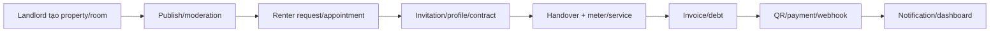

# Tài liệu yêu cầu chức năng MVP

**Đề tài:** Nền tảng Web/App quản lý và cho thuê phòng trọ, chung cư mini theo mô hình SaaS & Marketplace

**Sinh viên:** Nguyễn Văn Thiện — **MSSV:** 221A290093

**Giảng viên hướng dẫn:** Quách Anh Dũng  
**Baseline đối chiếu:** Backend working tree ngày 31/07/2026

## 1. Mục tiêu và phạm vi

MVP quản lý trọn hành trình từ nguồn cung phòng, tìm/đăng ký thuê, hợp đồng, vận hành điện nước/dịch vụ, hóa đơn/công nợ, thanh toán, hỗ trợ sự cố đến báo cáo. Backend dùng SaaS multi-tenant; marketplace public dùng chung nền tảng.

Phạm vi đã loại AI recommendation, AI pricing và chatbot. OCR công tơ là công cụ nhập liệu có người duyệt, không phải AI gợi ý sản phẩm. Dashboard dùng REST; Socket.IO dùng cho notification.

## 2. Actor

| Actor | Phạm vi |
|---|---|
| ADMIN | Quản trị nền tảng, tenant, landlord, plan, marketplace moderation, dashboard platform, trust moderation |
| LANDLORD/MANAGER/ACCOUNTANT/MAINTENANCE_STAFF | Vận hành trong tenant theo role và `x-tenant-id` |
| RENTER | Marketplace và self-service theo profile/contract/invoice/payment/ticket |

## 3. Ma trận yêu cầu FR-01–FR-30

`Backend có` nghĩa controller/service/repository đã được nạp; `cần tích hợp` nghĩa code adapter tồn tại nhưng cần dịch vụ thật; `client thiếu` nghĩa chưa có web/mobile để nghiệm thu hành trình người dùng.

| FR | Ưu tiên | Yêu cầu | Tiêu chí MVP | Hiện trạng 31/07 |
|---|---|---|---|---|
| FR-01 | Must | Đăng ký/đăng nhập/đăng xuất | Email/OTP/OAuth, token one-time/rotation | Backend có, unit test |
| FR-02 | Should | Hồ sơ cá nhân | Xem/sửa profile đúng user | Backend có |
| FR-03 | Must | RBAC và tenant isolation | Role đúng; tenant A không thấy B | Guard có; cần E2E DB |
| FR-04 | Must | Quản lý tenant/landlord | CRUD, status, verification | Backend có |
| FR-05 | Should | Plan/subscription | Plan, gán gói, checkout/lịch sử | Backend + PayOS; cần provider |
| FR-06 | Must | Nhà trọ/tầng | CRUD, scope tenant, soft delete | Backend có |
| FR-07 | Must | Phòng/ảnh/tiện ích | CRUD, upload, trạng thái | Backend có; storage cần provider |
| FR-08 | Must | Đăng marketplace | Chỉ phòng hợp lệ; có moderation | Backend có |
| FR-09 | Must | Tìm/lọc phòng | Khu vực, giá, diện tích, tiện ích | Backend có |
| FR-10 | Must | Chi tiết phòng | Dữ liệu public không lộ field nội bộ | Backend có |
| FR-11 | Must | Request/appointment | Tạo, xem, quyết định, hủy/đổi lịch | Backend core có |
| FR-12 | Must | Người thuê | Profile, lời mời, danh sách/lịch sử | Backend có |
| FR-13 | Must | Hợp đồng | Draft/update/activate/expire/cancel | Backend có |
| FR-14 | Should | Hợp đồng sắp hết hạn | Dashboard theo date range | Backend có |
| FR-15 | Must | Điện nước/dịch vụ | Meter, catalog, assignment, đơn giá | Backend có |
| FR-16 | Must | Chỉ số điện nước | Create/update/confirm, chống giảm chỉ số | Backend có |
| FR-17 | Could | OCR công tơ | Upload → xử lý → người dùng accept | Backend có; cần worker/provider |
| FR-18 | Must | Hóa đơn tháng | Tạo item tiền phòng/utility/service | Backend core có |
| FR-19 | Must | Trạng thái hóa đơn | Draft/issue/cancel/overdue/payment update | Backend có |
| FR-20 | Must | Công nợ | paid/remaining nhất quán | Backend có; cần concurrency E2E |
| FR-21 | Must | QR/payment | QR, confirmation, staff approve/reject | Backend + PayOS; cần provider |
| FR-22 | Must | Lịch sử thanh toán | Provider reference/idempotency/audit field | Backend có |
| FR-23 | Must | Ticket | Create/list/detail/assign/status/relation | Backend có |
| FR-24 | Should | Notification | Inbox/read, Socket.IO, push, queue | Backend có; Firebase/Redis cần tích hợp |
| FR-25 | Must | Dashboard chủ trọ | Room/revenue/debt/contract/ticket | Backend có |
| FR-26 | Should | Dashboard ADMIN | Summary/trend toàn nền tảng | Backend có |
| FR-27 | Must | Quản lý landlord | List/detail/lock-unlock | Backend có |
| FR-28 | Should | Marketplace moderation | List/detail/history/status | Backend có |
| FR-29 | Must | Web/mobile renter | Contract/invoice/payment/ticket/notification | API self-service có; client thiếu |
| FR-30 | Should | Xóa mềm/lịch sử | Soft-delete/audit/retention theo miền | Một phần; audit API còn backlog |

## 4. Luồng nghiệm thu cốt lõi

Luồng ticket và review/report chạy song song trên contract/room đã có quan hệ hợp lệ.

## 5. Yêu cầu phi chức năng

| Mã | Yêu cầu | Tiêu chí |
|---|---|---|
| NFR-01 | Bảo mật | Hash password, secret ngoài source, JWT/API key, rate limit, error không lộ nội bộ |
| NFR-02 | Cách ly | Guard + repository luôn áp dụng tenant/resource scope |
| NFR-03 | Toàn vẹn | Transaction/CAS/unique cho token, payment, webhook và state transition |
| NFR-04 | Hiệu năng | Pagination, index, select phù hợp; worker cho tác vụ nặng |
| NFR-05 | Khả dụng | Timeout/retry giới hạn, queue retry, shutdown hook |
| NFR-06 | Quan sát | Request ID, security event, provider/job status; không log secret/PII thừa |
| NFR-07 | Bảo trì | Module rõ ràng, OpenAPI sinh tự động, docs check |
| NFR-08 | Tương thích | JSON/ISO 8601, Swagger contract, client web/mobile tương lai |

## 6. Dữ liệu chính

Các miền chính: identity/token/device; tenant/plan/subscription; property/room/amenity/moderation; renter/request/appointment; contract/asset/handover/termination; meter/OCR/service; invoice/debt/payment/webhook; ticket/conversation; review/reputation/report; notification/job/audit/settings. Danh sách bảng canonical nằm tại [tài liệu CSDL](../db/db.md).

## 7. Tiêu chí hoàn thành MVP

- Backend vượt build, lint, unit test, Prisma validate và E2E trên PostgreSQL test.
- Hành trình cốt lõi chạy qua HTTP với tenant isolation và dữ liệu seed.
- Provider ngoài có smoke test staging hoặc được ghi rõ là chưa xác minh.
- Web hoặc mobile hiện thực hóa tối thiểu luồng renter; hiện tiêu chí này chưa đạt.
- Không còn finding security mức HIGH chưa có quyết định xử lý/chấp nhận rủi ro.
- OpenAPI, DB docs, G01–G12 và báo cáo tiến độ không lệch runtime.

## 8. Ngoài MVP

- AI recommendation/pricing và chatbot.
- E-signature pháp lý hoàn chỉnh, BI/warehouse, realtime dashboard và multi-region.
- Reputation đa nguồn tự động nếu chưa có policy/signal đủ tin cậy.
